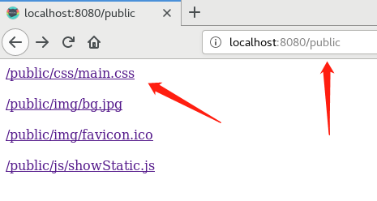
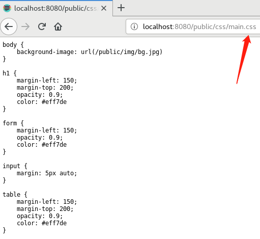
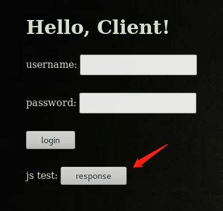
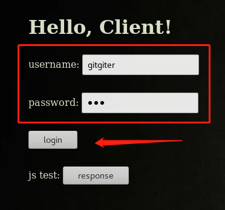
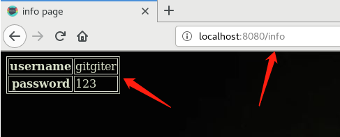
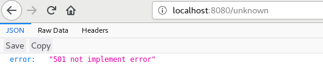

# 1、概述
这是一个web小应用，有以下几个功能：
- 支持静态文件服务
- 支持简单的js访问
- 提交表单，并输出一个表格
- 对/unknow给出开发中的提示，返回码501

# 2、配置
可以在configs目录下的main.tml对服务器后台进行一些基本配置，如当前配置
```sh
DisablePathCorrection = false
EnablePathEscape = false
FireMethodNotAllowed = true
DisableBodyConsumptionOnUnmarshal = false
TimeFormat = "Mon, 01 Jan 2006 15:04:05 GMT"
Charset = "UTF-8"
MyServerName = "gitgiter's iris"
```

# 3、运行
- 转到main.go所在目录，执行以下命令
```sh
go run main.go # 不指定端口默认8080

or

go run main.go -p 9090 # 指定监听9090端口
```

- 在浏览器地址栏输入
```sh
# 登录界面
http://localhost:yourport/login

# 静态资源文件服务
http://localhost:yourport/public

# 未开发
http://localhost:yourport/unknown
```

# 3、效果
- 主界面（背景来自我的github page）  

- 支持静态文件服务  
  

- 支持简单的js访问（可跳转到静态资源界面）  
  

- 提交表单，并输出一个表格  
  

- 对/unknow给出开发中的提示，返回码501  


# 3、其他
- 本程序使用了iris框架
- 实现细节详见博客
    - github page：[]()
    - csdn blog：[]()
