# 使用VMware搭建私有云桌面服务

## 1. 安装VMware虚拟机工作台
- 官网下载安装包
    - 版本：14.1.3 Pro
    - 地址：[https://my.vmware.com/en/web/vmware/info/slug/desktop_end_user_computing/vmware_workstation_pro/14_0](https://my.vmware.com/en/web/vmware/info/slug/desktop_end_user_computing/vmware_workstation_pro/14_0)
- 双击直接运行安装程序，按提示完成安装（网上教程较多不展开叙述）
- 激活密钥可以去网上找
- 贴一个我参考的教程：[安装+破解](https://jingyan.baidu.com/article/9f7e7ec09da5906f281554d6.html)

## 2. 配置CentOS 7虚拟机
- 官网下载镜像
    - 版本：CentOS 7 Minimal 1804
    - 地址：[https://www.centos.org/download/](https://www.centos.org/download/)
- 进入VMware主界面，点击创建新的虚拟机
- 配置新虚拟机（在弹出的安装向导中依次按下图操作）
    - 选典型，按下一步  
    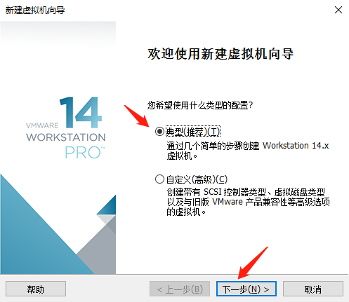
    - 选稍后安装操作系统，按下一步  
    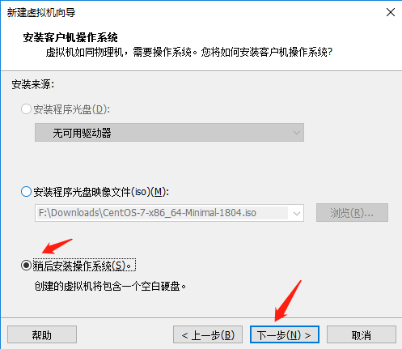
    - 选操作系统类型，版本，按下一步  
    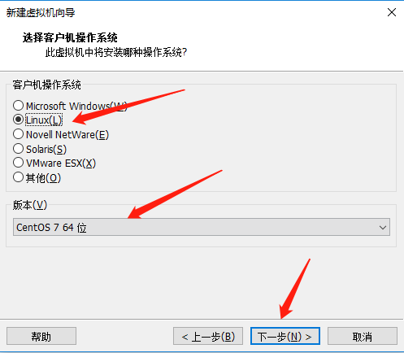
    - 定义新虚拟机名字和存储位置，按下一步  
    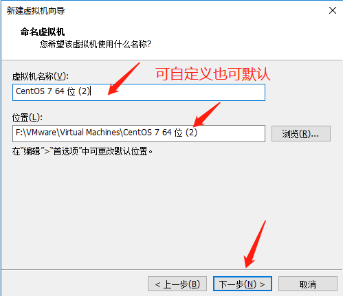
    - 设置最大磁盘大小，30g以上，按下一步  
    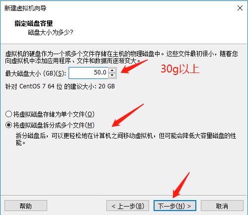
    - 选择自定义硬件，详细查看各种设置  
    
    - 内存2g以上，处理器1~2个，记得设置镜像位置  
    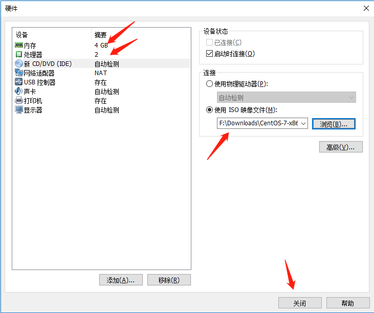
    - 点击完成开始配置新的虚拟机  
    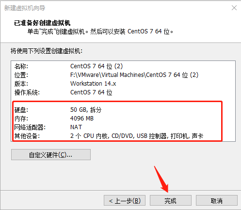
    - 等待配置完成

## 3. 配置网卡
- 创建第二块网卡（也可在前面自定义硬件的时候顺便设置）
    - 打开VMware，菜单栏中选择：虚拟机=>设置
    - 可见原来有个NAT模式的适配器（第一块网卡）
    - 在硬件栏下点添加键，添加一个网络适配器（即第二块网卡）
    - 将其网络连接模式设为仅主机模式
    - 效果：  
    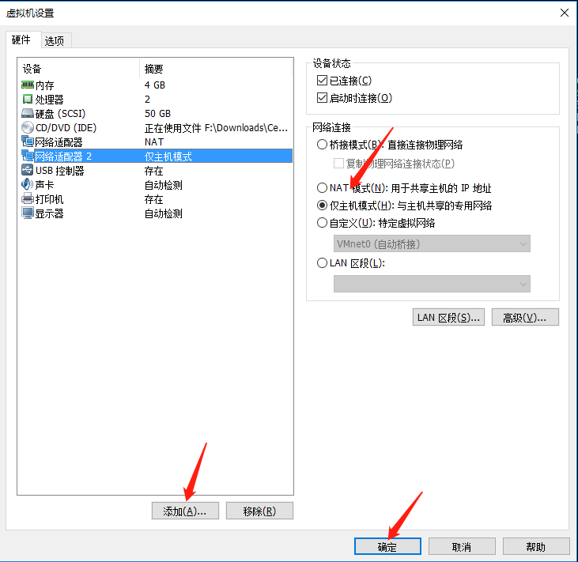

- 配置第二块网卡地址
    - 菜单栏中选择：编辑=>虚拟网络编辑器
    - 选中VMnet1，即以仅主机模式的虚拟网络
    - 配置虚拟机的ip网段：192.168.100.0（注意是0结尾，表示网段）
    - 效果：  
    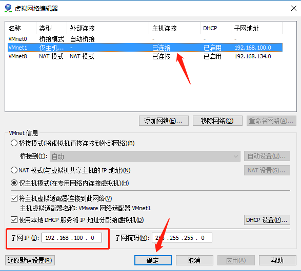

- 三种模式的区别（补充）
    - 桥接模式：使虚拟机相当于真实网络上的一台独立计算机，需要真实的物理网卡
    - NAT模式：使虚拟机可以通过主机单向访问外网，外网无法访问虚拟机
    - 仅主机模式：使虚拟机只能与主机互联，无法访问外网

## 4. 安装操作系统
- 开启刚配置好的虚拟机CentOS 7
- 如果提示Intel-VT没有激活
    - 重启主机，适当时候按F2进入BIOS界面
    - 点开高级模式（Advanced Mode）
    - 打开CPU设置（CPU Configuration）
    - 找到Intel 虚拟技术（Intel VT-x）
    - 将关闭改成开启（disable=>enable）
    - 重启电脑
    - 打开VMware，再次开启虚拟机
- 接下来按默认选择安装好操作系统即可（也可自行设置时区、磁盘分区等）
- 设置root密码和新建新用户
- 系统启动后登录root用户，进行下一步操作

## 5. 配置操作系统
- 先升级内核
```
yum update
```
- 安装wget
```
yum install wget
```
- 安装一个网络工具包（否则不能使用ifconfig、ifup、ifdown等命令，如果觉得nmcli和nmtui够用那就不用安装）
```
yum install net-tools
```
- 具体配置第二块网卡地址（之前只有网段，现在来指定具体的主机号，避免动态生成ip不固定）
    - 输入 ```nmtui```，弹出用户交互界面
    - 注：方向箭选择，回车确认，空格勾选
    - 选择Edit a Connection，回车，弹出连接管理的界面
    - 选择Add，回车，弹出选择网络类型
    - 选择Ethernet，回车，弹出详细设置页面
    - 为方便辨认，设置新连接的名称
    - 设置固定虚拟ip地址为：192.168.100.127/24（动态生成的一般是192.168.100.128，24是指定掩码格式）
    - 设置网关为主机上虚拟网卡VMnet1的ip地址，即192.168.100.1
    - 效果：  
    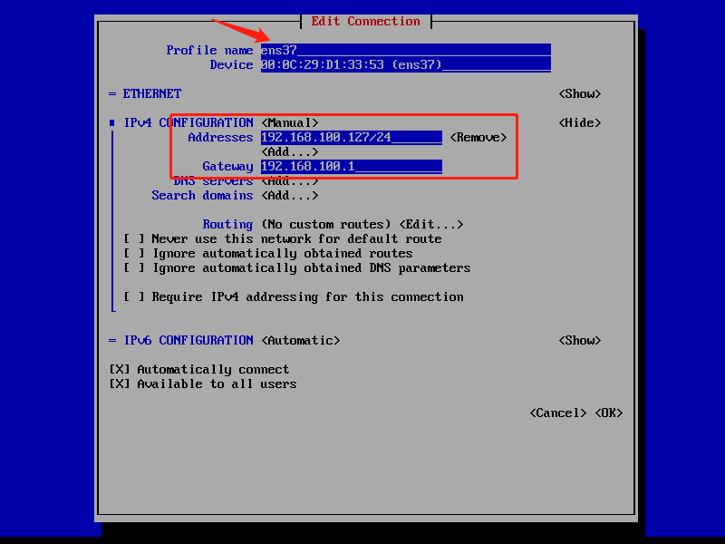  
    - 保存更改
- 激活第二块网卡
    - 回到nmtui的用户交互界面
    - 选择Activate a Connection
    - 选择新建立的连接，回车激活（连接名前面出现星号即激活）
    - 效果：  
    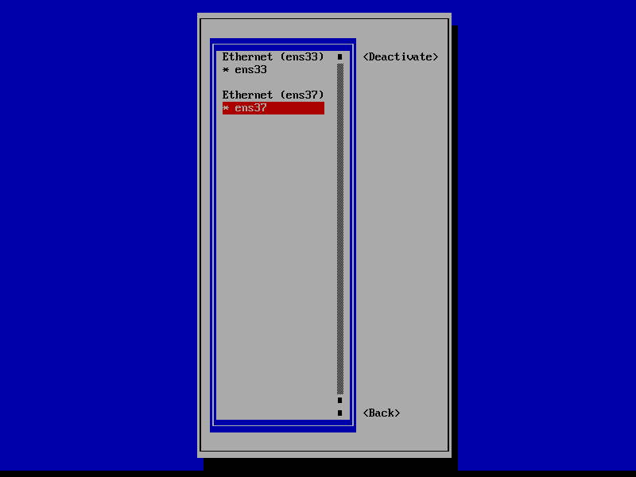

## 6. 检查配置结果
- 使用nmcli或ifconfig查看当前的网络配置（有两块网卡且已激活就算正确）
    - nmcli  
    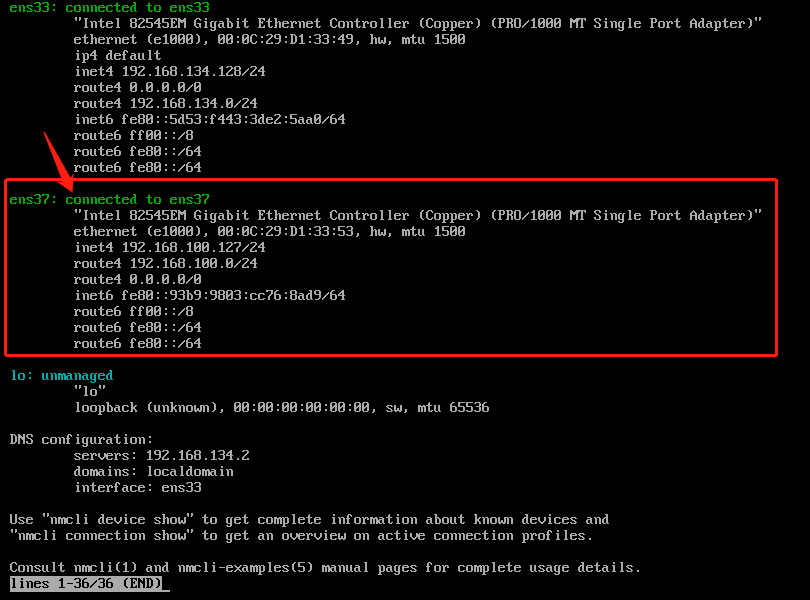
    - ifconfig  
    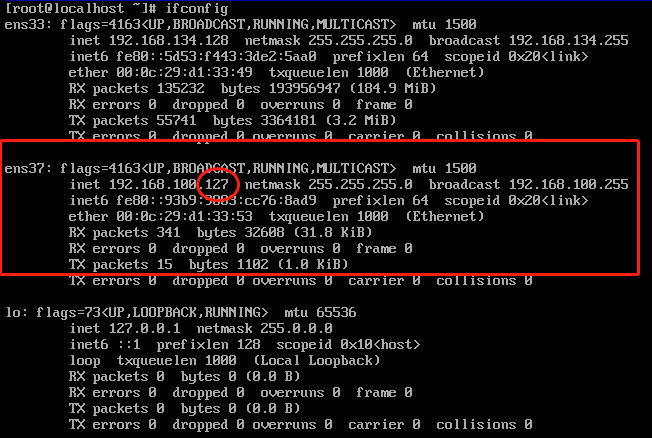
- 确认虚拟机能ping通主机
    - VMnet1：ping 192.168.100.1  
    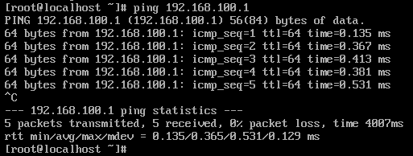
    - VMnet8：ping 192.168.134.1  
    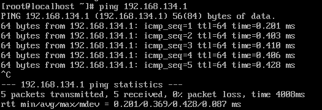
    - WLAN：ping 192.168.199.133  
    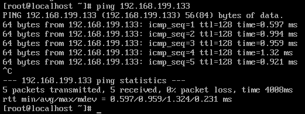
    - 以上结果说明三种方式都能ping通，虚拟机可以连主机也可以连外网
- 确认主机可以ping通虚拟机
    - VMnet1：ping 192.168.100.127  
    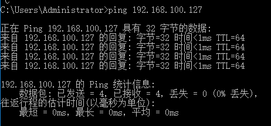
    - ssh远程控制
        - 打开主机的Git bash（未安装git需先安装git）
        - 使用ssh控制虚拟机
            - 控制方法
            ```
            ## 形如以下两例，@前是用户名 @后是网卡地址
            ssh tao@192.168.100.127
            ssh root@192.168.100.127
            ```
            - 控制用户tao  
            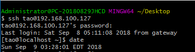
            - 控制root用户  
            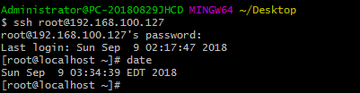
    - 以上结果说明主机和虚拟机互连成功

## 7. 复制虚拟机
- 关闭刚刚配置好的虚拟机
- 右键=>管理=>克隆
- 克隆向导依次按如下选择（按默认完成）
    - 欢迎界面，下一步  
    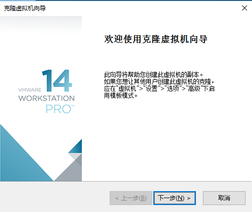
    - 克隆自当前状态，下一步  
    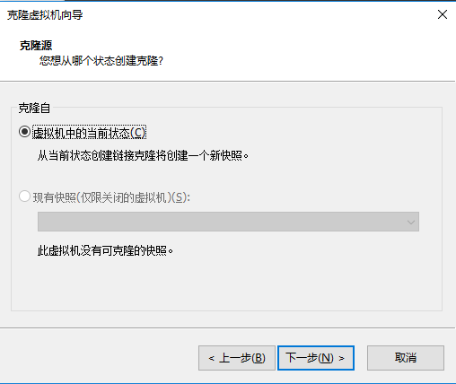
    - 链接复制，下一步  
    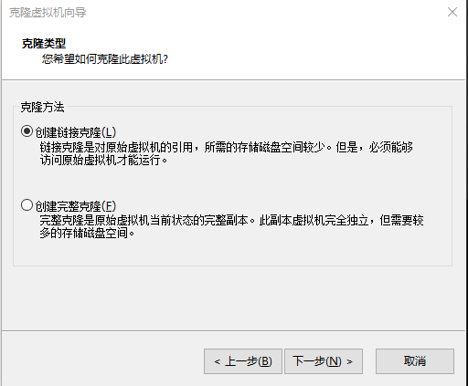
    - 自定义虚拟机名和路径，完成  
    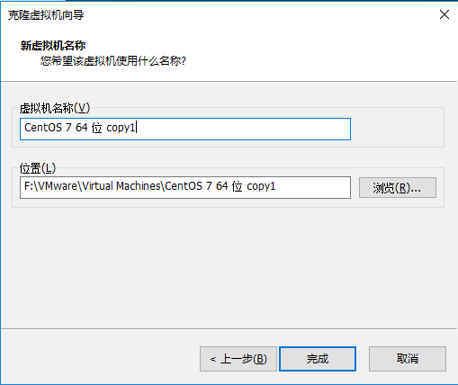
- 启动克隆机，重新配置第二块网卡（第一块网卡的mac地址会自动重新生成）
    - 删除克隆过来的第二块网卡（因为mac地址和base机冲突）
    - 重新添加第二块网卡（这里我设ip为192.168.100.126）
    - 效果（可以看到mac地址重新生成了，ip地址也改了）：  
    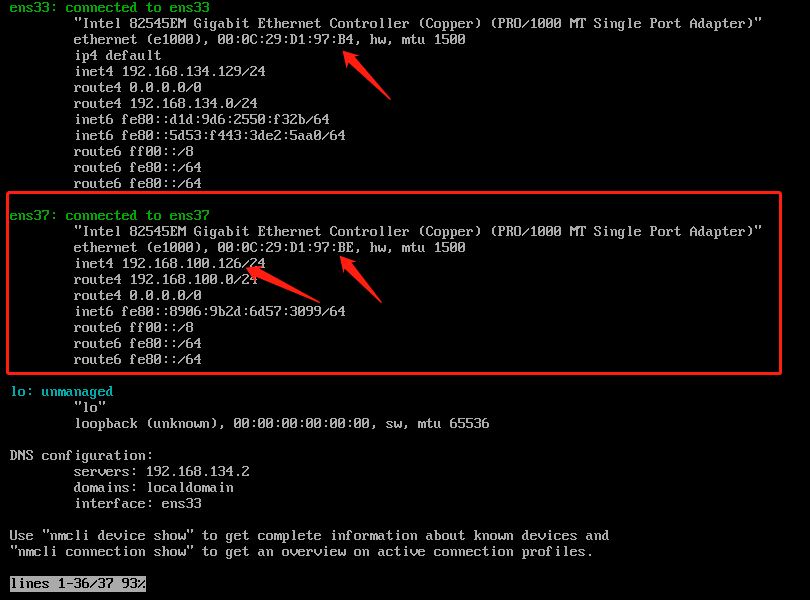

## 8. 检查最终配置
- ping主机以及验证ssh连接均没有问题（这里只展示ssh的）
    - 用户tao  
    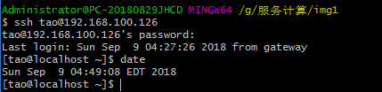
    - root用户  
    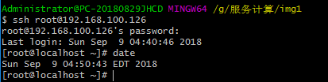
- 虚拟机之间互相ping
    - base机 ping 克隆机  
    
    - 克隆机 ping base机  
    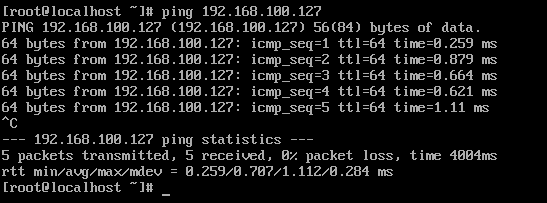
- 为了方便辨认，修改主机名
    - nmtui修改  
    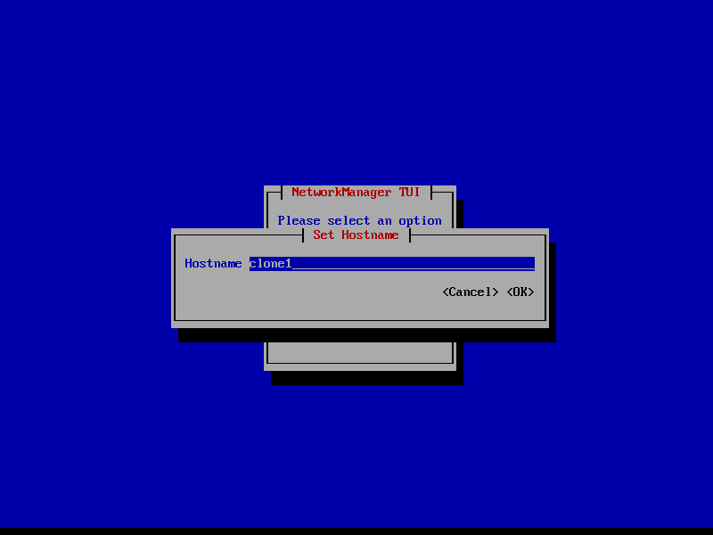    
    - base机改为base  
    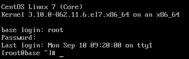
    - 克隆机改为clone1  
    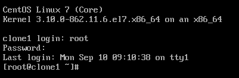

## 9. 远程桌面控制
- 安装桌面
```
## -y表示默认同意所有问题
yum -y groupinstall "GNOME Desktop"
```
- 设置启动目标为图形界面后重启
```
systemctl set-default graphical.target
```
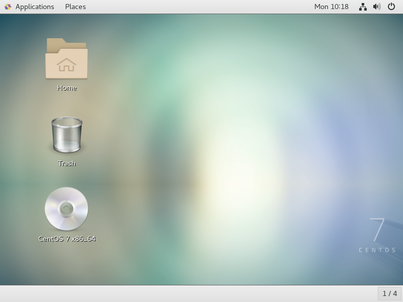
- 安装epel（免费开源发行软件包版本库）
```
yum install epel-release
```
- 安装xrdp（远程连接证书）
```
yum install xrdp
```
- 安装tigervnc-server（xrdp会自动启用vnc，所以必须安装）
```
yum install tigervnc-server
```
- 关闭防火墙
```
systemctl stop firewalld
systemctl disable firewalld
```
- 远程连接
    - 启动Windows的rdp  
        - 方法一：在搜索栏搜索远程桌面连接
        - 方法二：Win+R后输入mstsc回车
    - 输入虚拟机的ip地址和用户名，连接  
    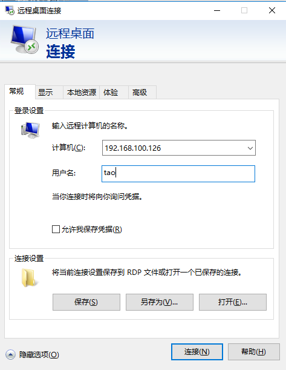
    - 连接后输入用户密码  
    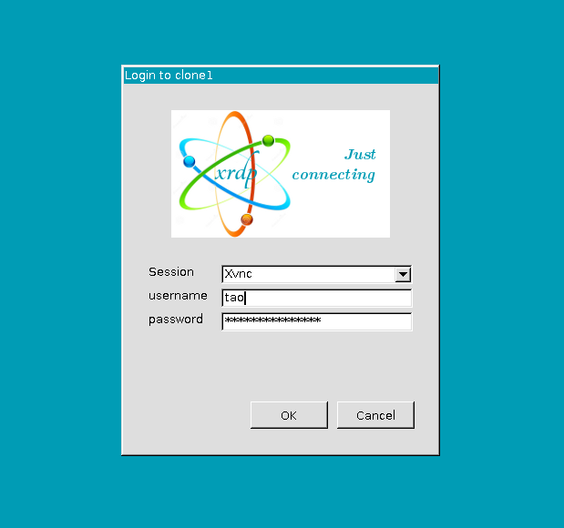
    - 登陆后便可进行远控
    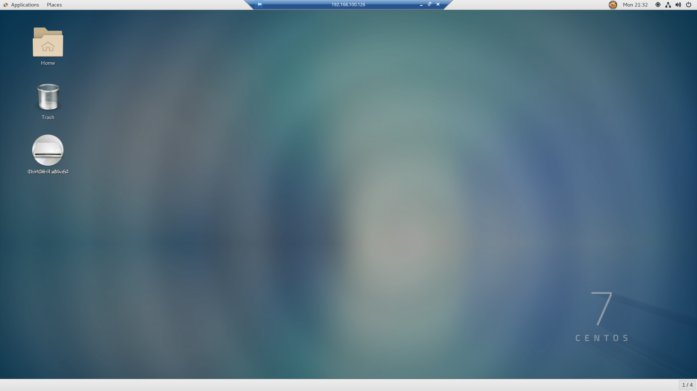